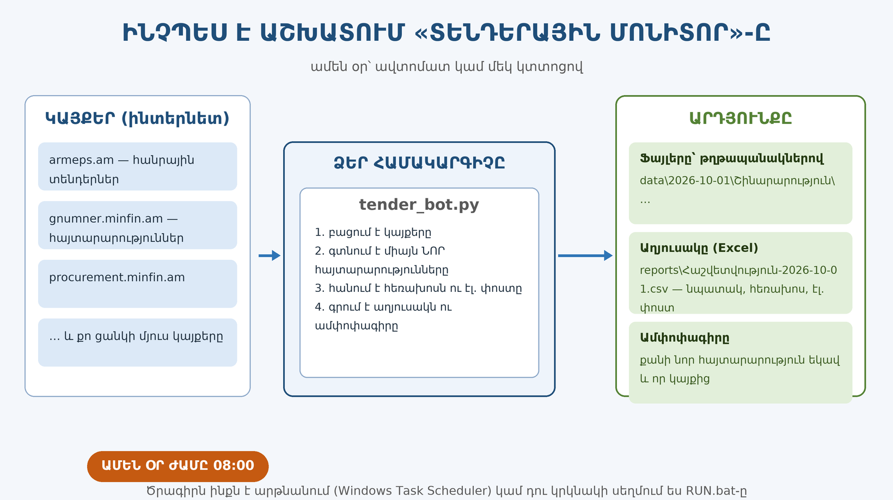
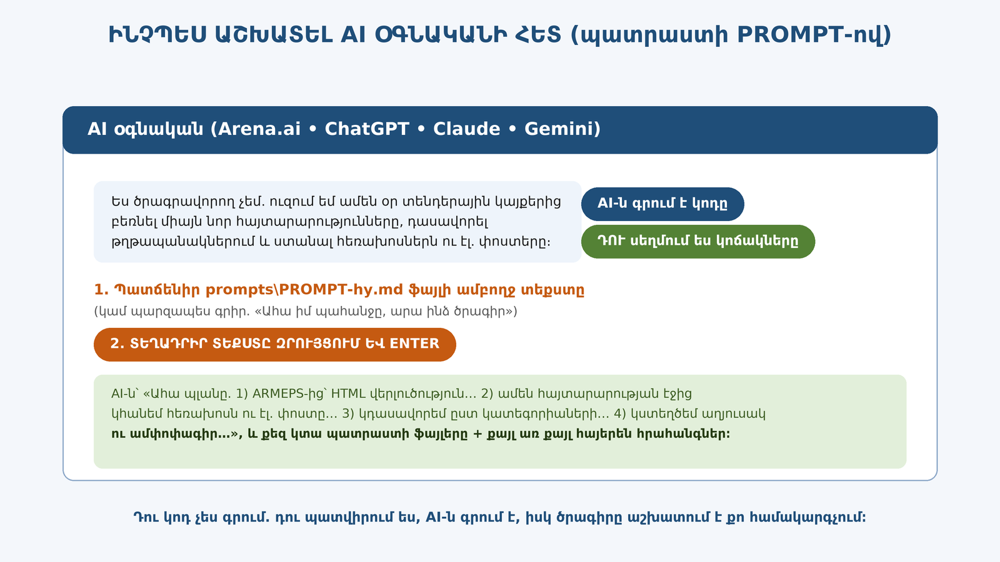
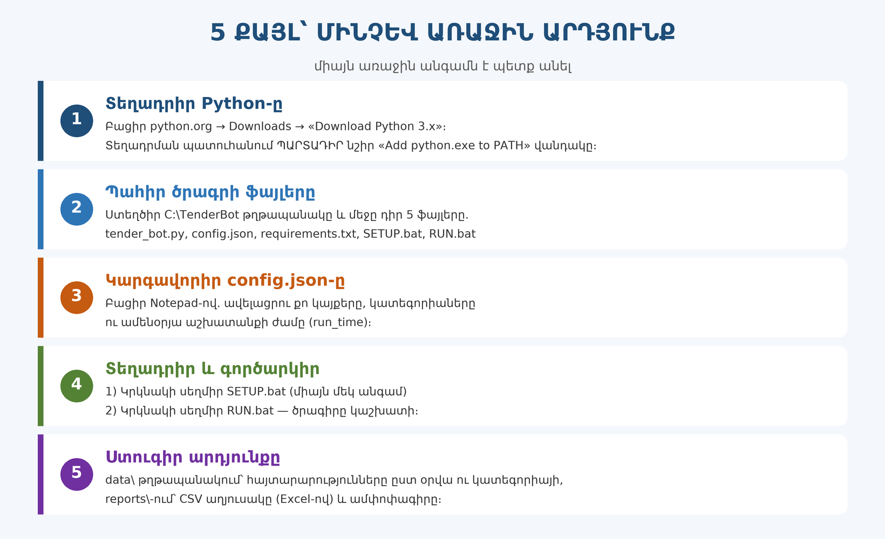
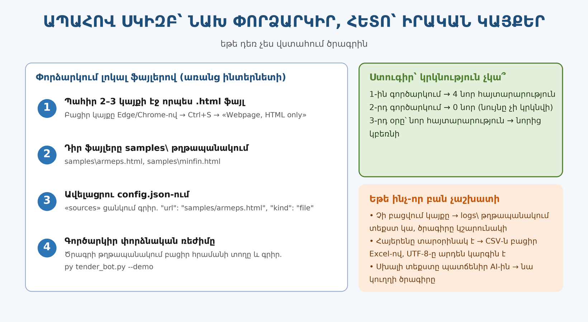
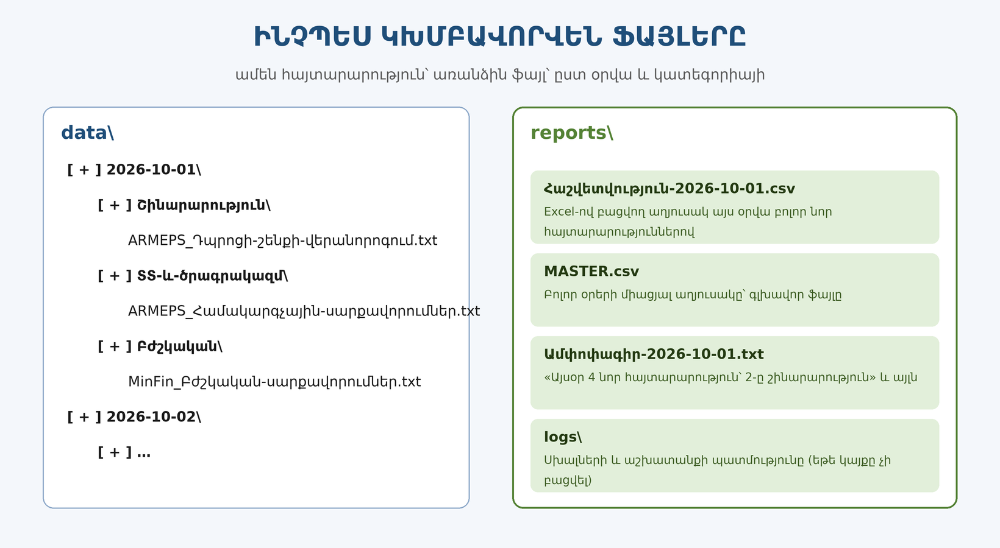
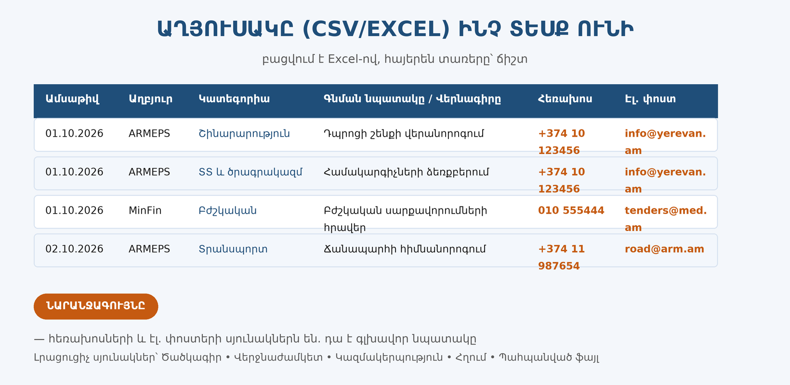
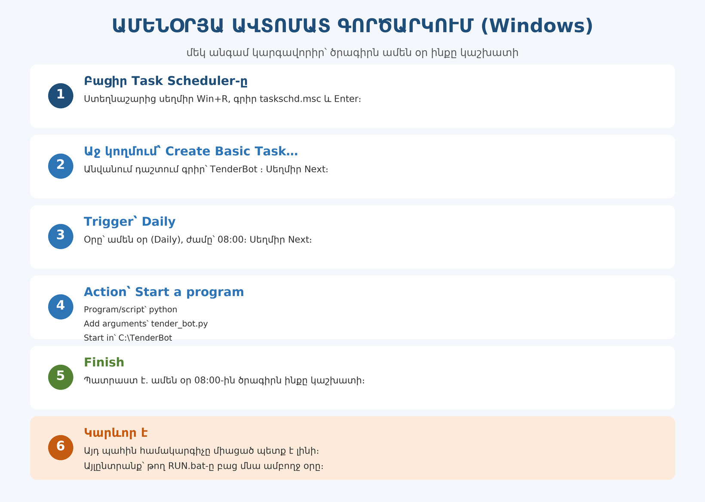
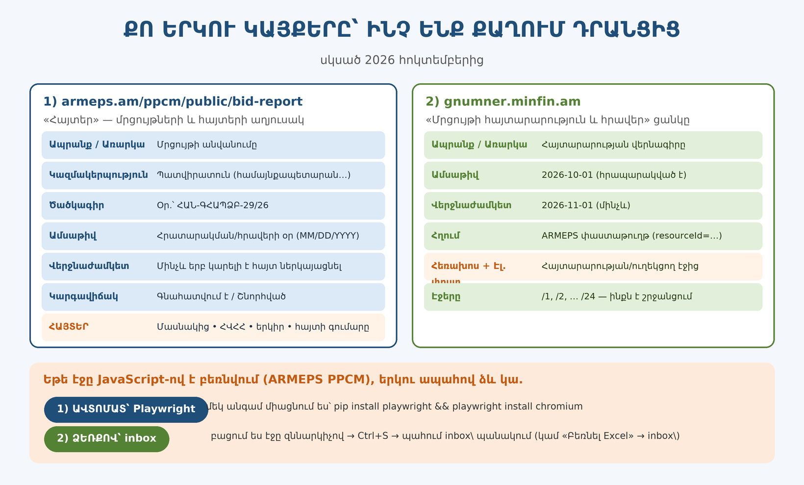

# 📚 Քայլ առ քայլ՝ ԻՆՉՊԵՍ ԱՎՏՈՄԱՏԱՑՆԵԼ ՏԵՆԴԵՐՆԵՐԻ ԱՄԵՆՕՐՅԱ ՀԱՎԱՔՈՒՄԸ

> Այս ուղեցույցը գրված է այնպես, որ **առանց ծրագրավորում իմանալու** կարողանաս ստանալ մի ծրագիր, որը.
> ամեն օր ինքը բեռնում է տենդերային կայքերից նոր հայտարարությունները, դասավորում թղթապանակներում,
> և քեզ տալիս է աղյուսակ՝ **նպատակով, հեռախոսահամարներով ու էլ. փոստերով**։

⏱ Առաջին անգամը տևում է մոտ **30–40 րոպե**։ Հետո՝ ամեն օր 0 րոպե (ամեն ինչ ինքն է արվում)։



---

## 🗂 Բովանդակություն

| Քայլ | Ինչ ենք անում |
|---|---|
| [Քայլ 0](#քայլ-0) | Ի՞նչ է «prompt»-ը և ինչու է դա քեզ պետք |
| [Քայլ 1](#քայլ-1) | Ընտրում ենք կայքերը |
| [Քայլ 2](#քայլ-2) | Prompt-ը տալիս ենք AI օգնականին |
| [Քայլ 3](#քայլ-3) | Ստանում ենք պատրաստի ծրագիր |
| [Քայլ 4](#քայլ-4) | Տեղադրում ենք Python-ը |
| [Քայլ 5](#քայլ-5) | Ֆայլերը դնում ենք թղթապանակում |
| [Քայլ 6](#քայլ-6) | Կարգավորում ենք `config.json`-ը |
| [Քայլ 7](#քայլ-7) | Առաջին գործարկում (փորձնական, ապահով) |
| [Քայլ 8](#քայլ-8) | Ստուգում ենք արդյունքը |
| [Քայլ 9](#քայլ-9) | Դնում ենք ամենօրյա ավտոմատ աշխատանքի |
| [Քայլ 10](#քայլ-10) | Եթե ինչ-որ բան չաշխատի |
| [Հավելված Ա](#հավելված-ա-պատրաստի-բոտը) | Պատրաստի բոտ՝ առանց AI-ի |
| [Հավելված Բ](#հավելված-բ-քո-երկու-կայքերը) | Քո երկու կայքերը՝ «Հայտեր» և «Մրցույթի հայտարարություն» |

---

<a name="քայլ-0"></a>
## Քայլ 0. Ի՞նչ է «prompt»-ը և ինչու է դա քեզ պետք

**Prompt** (կարդացվում է «պռոմտ») նշանակում է **պատվեր/հանձնարարական**, որը դու գրում ես արհեստական բանականությանը (AI օգնականին)։ Այդ պատվերի մեջ դու բացատրում ես՝ ինչ ես ուզում, ինչպես, որտեղ և ինչու։

AI-ն կարդում է քո պատվերը և գրում է **ծրագրի կոդը** (տեքստային ինստրուկցիաներ, որոնք կատարում է համակարգիչը)։ Այսինքն.

> 🙋 Ու չես գրում կոդը — **դու պատվիրում ես, AI-ն գրում է**, իսկ ծրագիրը աշխատում է քո համակարգչում։



Որ AI-ն լավ արդյունք տա, պատվերը պետք է **մանրամասն և հստակ** լինի։ Այդ աշխատանքը նախապես արված է քեզ համար. պատրաստի prompt-ը գտնվում է այստեղ 👉 **`prompts/PROMPT-hy.md`** (անգլերեն տարբերակը՝ `prompts/PROMPT-en.md`)։

---

<a name="քայլ-1"></a>
## Քայլ 1. Ընտրիր կայքերը

Գրիր թղթի վրա այն կայքերի հասցեները, որտեղից ուզում ես տեղեկություն բեռնել։ Հայաստանի տենդերների համար ամենակարևորներն են.

| Կայք | Ինչ կա այնտեղ |
|---|---|
| **`armeps.am/ppcm/public/bid-report`** | **PPCM «Հայտեր»** — մրցույթների աղյուսակ (պատվիրատու, ծածկագիր, անվանում, օրեր, կարգավիճակ) և **հայտերի աղյուսակ** (մասնակից, ՀՎՀՀ, երկիր, գումար) |
| **`gnumner.minfin.am/hy/page/bac_mrcuyti_haytararutyun_ev_hraver/`** | **«Մրցույթի հայտարարություն և հրավեր»** — ցանկ, որտեղ ամեն գրառում ունի հրապարակման օր, վերջնաժամկետ և հղում դեպի ARMEPS փաստաթուղթ |
| `gnumner.minfin.am/hy/page/gnumneri_haytararutyunner_/` | Գնումների հայտարարությունների հիմնական ցանկը |
| `procurement.minfin.am/hy/page/hraverum_katarvats_popokhutyunner/440` | Հրավերներում կատարված փոփոխություններ և այլ հայտարարություններ |
| *(քո կայքը)* | Ավելացրու նաև այն կայքերը, որոնցով ամեն օր դու ես աշխատում՝ մինիստրություններ, համայնքներ, բանկեր, մասնավոր ընկերություններ |

💡 **Եթե չգիտես հասցեն.** բացիր կայքը զննարկիչով (Edge կամ Chrome), ընդգծիր հասցեի տողի ամբողջ տեքստը և պատճենիր (`Ctrl+C`)։

💡 **Եթե կայքում հայտարարությունների ցանկն առանձին էջում է** (օր. «Հայտարարություններ» կամ «Tenders» բաժինը), հենց այդ էջի հասցեն տուր. ծրագիրը կաշխատի ցուցակի էջերի հետ։

---

<a name="քայլ-2"></a>
## Քայլ 2. Prompt-ը տուր AI օգնականին

1. Բացիր `prompts/PROMPT-hy.md` ֆայլը (երկու կտտոցով, որպես տեքստային ֆայլ)։
2. Ընտրիր ամբողջ տեքստը (`Ctrl+A`) և պատճենիր (`Ctrl+C`)։
3. Բացիր AI օգնականին (Arena.ai, ChatGPT, Claude, Gemini և այլն)։
4. Տեղադրիր տեքստը զրույցի դաշտում (`Ctrl+V`)։
5. **Չմոռանաս** ներքևում ավելացնել քո կայքերի հասցեները (այնտեղ նշված է «<ԱՅՍՏԵՂ ԱՎԵԼԱՑՐՈ ՔՈ ԿԱՅՔԵՐԸ>» տողը)։
6. Սեղմիր Enter և սպասիր պատասխանին։

📌 Որ AI-ն քեզ բոլորովին ճիշտ հասկանա, կարող ես սկզբում գրել մեկ նախադասություն հայերեն.
> *«Ես ծրագրավորող չեմ։ Ուզում եմ ծրագիր, որը ամեն օր կայքերից բեռնի միայն նոր հայտարարությունները, դասավորի թղթապանակներով և դուրս բերի հեռախոսները, էլ. փոստերը ու գնման նպատակը։ Կարդա իմ ամբողջ պահանջը և արա ինձ պատրաստի ֆայլերը։»*

---

<a name="քայլ-3"></a>
## Քայլ 3. Ստացիր պատրաստի ծրագիրը

AI-ն քեզ պետք է տա **5 ֆայլ**.

| Ֆայլ | Ինչի համար է |
|---|---|
| `tender_bot.py` | Հիմնական ծրագիրը |
| `config.json` | Կարգավորումները (կայքեր, կատեգորիաներ, ժամ) |
| `requirements.txt` | Օժանդակ գրադարանների ցանկը |
| `SETUP.bat` | Մեկ կտտոցով տեղադրման ֆայլ |
| `RUN.bat` | Մեկ կտտոցով գործարկման ֆայլ |

Ամենայն հավանականությամբ AI-ն անմիջապես կտա պատրաստի կոդեր։ Եթե չի տվել, գրիր.
> *«Տուր ինձ պատրաստի tender_bot.py, config.json, requirements.txt, SETUP.bat և RUN.bat ֆայլերը, ինչպես նաև հայերեն քայլ առ քայլ հրահանգ՝ Windows-ի համար։ Իսկ տողերի միջև բացատրություններով մի գրիր, կոդը պետք է ամբողջական լինի։»*

Ֆայլերը պահելու պարզ եղանակը.
1. Ամեն ֆայլի վերևի աջ անկյունում սեղմիր **«Copy»** կամ բլոկի վրա՝ *«Copy code»*։
2. Բացիր **Notepad**-ը (Սկիզբ → Notepad)։
3. Տեղադրիր (`Ctrl+V`)։
4. **Ֆայլ → Save as** → անունը դիր ճիշտ՝ *վերջավորությունը նույնպես* (`tender_bot.py`, `config.json`, …) և Տեսակը դիր **All files** (`*.*`), այլապես կստացվի `tender_bot.py.txt`։

⚠️ **Կարևոր.** Notepad-ը կարող է անվանը ավելացնել `.txt`։ Ուշադիր ստուգիր ֆայլերի անունները։

---

<a name="քայլ-4"></a>
## Քայլ 4. Տեղադրիր Python-ը (միայն մեկ անգամ)



1. Բացիր `https://www.python.org/downloads/` զննարկիչով։
2. Սեղմիր դեղին **«Download Python 3.x»** կոճակը։
3. Բացիր ներբեռնված ֆայլը։
4. ❗ **Առաջին էկրանին նշիր «Add python.exe to PATH» վանդակը** (շատ կարևոր է, թե չէ ծրագիրը չի գտնի Python-ը)։
5. Սեղմիր **Install Now** և սպասիր մինչև վերջանա։

Ստուգելու համար. սեղմիր ստեղնաշարից `Win` + `R`, գրիր `cmd` և Enter։ Բացված սև պատուհանում գրիր `python --version` և Enter։ Պետք է տպի ինչ-որ բան, օրինակ՝ `Python 3.12.4`։

---

<a name="քայլ-5"></a>
## Քայլ 5. Ֆայլերը դիր մի տեղ

1. Բացիր «This PC» → `C:` դիսկ։
2. Ստեղծիր նոր թղթապանակ անունով՝ **`TenderBot`**։
3. Մեջը տեղափոխիր AI-ից ստացած 5 ֆայլերը։

Ստացվում է այսպիսի տեսք.
```
C:\TenderBot\
   tender_bot.py
   config.json
   requirements.txt
   SETUP.bat
   RUN.bat
```
💡 Խորհուրդ. այս թղթապանակն անվանիր `TenderBot` և ուղղությունը մի՛ փոխիր, որովհետև հետո ավտոմատացման կարգավորումները այս ուղղությանը կհղվեն։

---

<a name="քայլ-6"></a>
## Քայլ 6. Կարգավորիր `config.json`-ը

Սա այն ֆայլն է, որտեղ «բնակվում են» քո կայքերը և ցանկերը։ Բացիր `Notepad`-ով.

```json
{
  "run_time": "08:00",
  "delay_seconds": 2,
  "sources": [
    { "name": "ARMEPS",  "url": "https://armeps.am/ppcm/public/tenders", "kind": "html" },
    { "name": "MinFin",  "url": "https://gnumner.minfin.am/hy/page/norutyunner/", "kind": "html" },
    { "name": "Իմ կայքը", "url": "https://իմ-կայքի-հասցեն.am/", "kind": "html" }
  ],
  "categories": {
    "Շինարարություն": ["շին", "կառուց", "վերանորոգ"],
    "ՏՏ և ծրագրակազմ": ["համակարգիչ", "ծրագր", "սերվեր"],
    "Բժշկական": ["բժշկ", "դեղ", "հիվանդանոց"],
    "Տրանսպորտ": ["տրանսպորտ", "մեքենա", "ճանապարհ", "վառելիք"],
    "Ծառայություններ": ["ծառայություն", "սպասարկում", "խորհրդատվ"],
    "Այլ": []
  }
}
```

**Ինչ կարող ես փոխել.**
- `run_time` — ժամը, երբ պետք է ամեն օր աշխատի (օր. `"07:30"`)։
- `sources` — կայքերի ցանկը. ամեն կայքի համար՝ անուն և հասցե։
- `categories` — կատեգորիաները և դրանց «բանալի բառերը»։ Եթե հայտարարության տեքստում այդ բառը կա, ֆայլը կընկնի համապատասխան թղթապանակը։ Որ ոչինչ չմոռանաս, վերջին տողը թող «Այլ» մնա (դատարկ բառերով)։
- `"only_keywords": []` — եթե լրացնես բառերով, ծրագիրը միայն այդ բառերով հայտարարությունները կբեռնի։

💡 Բանալի բառերը հայերեն գրիր **առանց մեծատառի**, օր.՝ `"շին"`։ Դա գտնում է և՛ «շինարարություն», և՛ «շինարարական»։

---

<a name="քայլ-7"></a>
## Քայլ 7. Առաջին գործարկում (փորձնական)



1. Բացիր `C:\TenderBot` թղթապանակը։
2. Կրկնակի սեղմիր **`SETUP.bat`** (միայն մեկ անգամ). Բացված սև պատուհանում կտեղադրվեն անհրաժեշտ գրադարանները։ Երբ գրի `Press any key to continue`, սեղմիր ստեղնաշարից որևէ կոճակ։
3. Կրկնակի սեղմիր **`RUN.bat`**։ Կբացվի պատուհան, որը կցուցադրի աշխատանքի ընթացքը։

Որ սկսես առանց ռիսկի (առանց իրական կայքերին դիպչելու). բոտի թղթապանակում բացիր հրամանի տողը և գործարկիր.
```
py tender_bot.py --demo
```
`--demo` ռեժիմը ցույց կտա, թե ծրագիրն ինչպես է աշխատում, **առանց ինտերնետից բեռնելու** (օգտագործում է `samples\` թղթապանակի օրինակ ֆայլերը)։

---

<a name="քայլ-8"></a>
## Քայլ 8. Ստուգիր արդյունքը



Ծրագրի թղթապանակում կհայտնվեն երկու նոր թղթապանակ։

**`data\`** — այստեղ պահվում են հայտարարությունները՝ առանձին ֆայլերով, ըստ օրվա և կատեգորիայի.
```
data\2026-10-01\Շինարարություն\ARMEPS_Դպրոցի-շենքի-վերանորոգում.txt
data\2026-10-01\Բժշկական\MinFin_Բժշկական-սարքավորումներ.txt
```

**`reports\`** — այստեղ է **գլխավոր արդյունքը**՝ աղյուսակը, որն երազում էիր.
հայտարարությունների աղյուսակից բացի կլինի նաև **`MASTER-Հայտեր.csv`**՝ Հայտեր»-ի աղյուսակը (մասնակից, ՀՎՀՀ, հայտի գումար)։



- `Հաշվետվություն-2026-10-01.csv` — այդ օրվա բոլոր նոր հայտարարությունները՝ **նպատակով, հեռախոսով և էլ. փոստով**։
- `MASTER.csv` — բոլոր օրերի միացյալ աղյուսակը (ամենակարևոր ֆայլը՝ հենց այստեղ են կուտակվում բոլոր տվյալները)։
- `Ամփոփագիր-2026-10-01.txt` — կարճ ամփոփագիր՝ քանի նոր հայտարարություն եկավ և որտեղից։
- `logs\` — եթե ինչ-որ կայք չի բացվել, պատճառը կա այստեղ։

**CSV ֆայլը բացելու ճիշտ եղանակը.**
1. Բացիր **Excel**-ը → **File → Open** → ընտրիր `MASTER.csv`։
2. Հայերենը ճիշտ կերևա (ֆայլը պահպանվում է UTF-8 ձևաչափով)։

---

<a name="քայլ-9"></a>
## Քայլ 9. Դիր ամենօրյա ավտոմատ աշխատանքի



1. Սեղմիր `Win` + `R`, գրիր `taskschd.msc`, Enter — կբացվի **Task Scheduler**-ը։
2. Աջ կողմում սեղմիր **Create Basic Task…**։
3. **Name:** `TenderBot` → Next։
4. **Trigger:** `Daily` → ժամը դիր `08:00` → Next։
5. **Action:** `Start a program` → Next։
   - **Program/script:** `python`
   - **Add arguments:** `tender_bot.py`
   - **Start in:** `C:\TenderBot`
6. Finish։

Պատրաստ է. ամեն օր ժամը 08:00-ին ծրագիրն ինքը կստուգի կայքերը։

⚠️ **Երկու կարևոր պայման.**
- Այդ պահին **համակարգիչը միացած ու ինտերնետին միացած** պետք է լինի։
- Ավելի հուսալի տարբերակ է **`RUN.bat`-ը բաց պահել ամբողջ օրը**։ Այդ դեպքում ծրագիրն ինքն է սպասում և ամեն օր ժամը 08:00-ին արթնանում է։ Դրա համար `RUN.bat`-ի ներսում `python tender_bot.py` տողը փոխարինիր `python tender_bot.py --loop` տողով։

---

<a name="քայլ-10"></a>
## Քայլ 10. Եթե ինչ-որ բան չաշխատի

| Իրավիճակ | Ինչ անել |
|---|---|
| Սև պատուհանը ցույց է տալիս `python is not recognized` | Python-ը տեղադրված չէ կամ PATH վանդակը չես նշել — նորից տեղադրիր Python-ը և ուշադիր կարդա Քայլ 4-ի 4-րդ կետը |
| Չի բացվում կայքը | Ծրագիրը գրում է `logs\` ֆայլում պատճառը և շարունակում է մյուս կայքերով |
| Հայտարարությունները շատ են | Սահմանափակիր `categories`-ի բառերով և ավելացրու `only_keywords` |
| Հայտարարություն չի գտնում | Հավանաբար կայքը փոխել է իր կառուցվածքը — պատճենիր `logs\`-ի վերջին տողերը և ուղարկիր AI-ին |
| Ծրագիրը աշխատում է, բայց հեռախոսի սյունակը դատարկ է | Հեռախոսները հաճախ դետալային էջում են. այդ դեպքում ասա AI-ին. «Միացրու ֆունկցիան, որը բացում է ամենարմատ հղումները (fetch_detail_pages: true)» |

**Ամենակարևոր խորհուրդը.** երբ ծրագիրը կոտրվի, կրկին բացիր AI-ի հետ նույն զրույցը և գրիր.
> *«Աշխատեց, բայց հիմա այս սխալն է տալիս. [պատճենիր սխալի տեքստը]։ Խնդրում եմ ուղղիր ֆայլը ամբողջությամբ և տուր նոր տարբերակը։»*

Այսպես դու ստանում ես **քո անձնական տեխնիկական աջակցությունը**, առանց որևէ մեկին վճարելու։

---

## Հավելված Ա. Պատրաստի բոտը

Եթե այս պահին չես ուզում AI-ից պատվիրել կամ պարզապես ուզում ես **միանգամից փորձել** արդյունքը — այս պահոցում (repository) արդեն կա պատրաստի բոտ՝ **`bot/`** թղթապանակում.

| Ֆայլ | Ինչ է |
|---|---|
| `bot/tender_bot.py` | Ծրագիրն ամբողջությամբ, պատրաստ աշխատելու |
| `bot/config.json` | Կարգավորումները (ավելացրու քո կայքերը) |
| `bot/SETUP.bat` | Կրկնակի սեղմիր մեկ անգամ |
| `bot/RUN.bat` | Կրկնակի սեղմիր ամեն օր (կամ դիր Task Scheduler-ի վրա) |
| `bot/samples/` | Օրինակ ֆայլեր `--demo` ռեժիմի համար |
| `bot/README-hy.md` | Մանրամասն հրահանգ այս բոտի համար |

Այն ունի նաև հնարավորություններ.
```
py tender_bot.py            # մեկ անգամ ստուգել բոլոր կայքերը
py tender_bot.py --demo     # փորձնական՝ առանց ինտերնետի
py tender_bot.py --loop     # ամեն օր ժամը config-ի run_time-ին ինքը կաշխատի
py tender_bot.py --reset    # ամեն ինչ նորից բեռնել (ամբողջ արխիվը)
```

## Հավելված Բ. Քո երկու կայքերը



### 1) `armeps.am/ppcm/public/bid-report` — «Հայտեր»

| Սյունակ | Ինչ է նշանակում |
|---|---|
| Պատվիրատու | Ով է գնումը կազմակերպում (համայնքապետարան, նախարարություն, ՓԲԸ…) |
| Մրցույթի ծածկագիրը | Օր.՝ `ՀԱՆ-ԳՀԱՊՁԲ-29/26` |
| Մրցույթի անվանումը | **Ապրանքը / առարկան / նպատակը** (այն, ինչ դու փնտրում ես) |
| Հրատարակման օր | Երբ է տպագրվել (օր/ամիս/տարի) |
| Հայտերի վերջնաժամկետ | Մինչև երբ կարելի է հայտ ներկայացնել |
| Կարգավիճակ | Գնահատվում է / Շնորհված |
| **Հայտեր** | Մասնակից • ՀՎՀՀ/անձնագիր • Երկիրը • Հայտի գումարը |

⚠️ Այս էջի աղյուսակը բեռնվում է **JavaScript**-ով։ Ուստի պատրաստի բոտն առաջարկում է երկու ուղի.
1. **Ավտոմատ.** տեղադրիր Playwright-ը մեկ անգամ.
   `pip install playwright` ապա `playwright install chromium`
2. **Ձեռքով (միշտ աշխատում է).** բացիր էջը զննարկիչով → աջ սեղմիր → *«Сохранить как / Save as»* → պահիր `.html`
   (կամ սեղմիր էջի **«Բեռնել Excel»** հղումը) → ֆայլը դիր բոտի **`inbox\`** թղթապանակը։
   Ծրագիրը մյուս գործարկման ժամանակ ինքը կկարդա ֆայլը, և կտվյալները կհայտնվեն նույն աղյուսակում։

### 2) `gnumner.minfin.am/hy/page/bac_mrcuyti_haytararutyun_ev_hraver/` — «Մրցույթի հայտարարություն և հրավեր»

Ամեն գրառման տակ կա այսպիսի տող.
> (Հրապարակված է 2026-10-01 13:30:00-ից մինչեւ 2026-11-01 11:00:00 ժամը ներառյալ)

Ծրագիրն այս մեկ տողից հանում է **հրապարակման օրը** և **վերջնաժամկետը**, իսկ հղումից՝ փաստաթղթի էջը։ Էջերը շրջանցվում են
(`/1, /2, … /24`), այնպես որ **ամբողջ արխիվը** կարելի է հավաքել մեկ գործարկումով։

### Ինչպես սկսել հոկտեմբերից

```bash
py tender_bot.py --archive               # 2026-10-01-ից սկսած ամբողջ արխիվը
py tender_bot.py --since 2026-10-01      # նույնը՝ բայց առանց հին էջերը շրջանցելու
py tender_bot.py                         # ամեն օրից հետո՝ միայն նորերը
```

💡 **Կյանքի կանոն.** հոկտեմբերից սկսած հայտարարությունները, որոնց **վերջնաժամկետը դեռ չի անցել**, նույնպես կհայտնվեն
աղյուսակում, նույնիսկ եթե հրապարակվել են ավելի վաղ։ Այդպես ոչ մի գնում բաց չի մնա։

## Հավելված Գ. Անվտանգության և պարկեշտության կանոններ

- Բեռնիր միայն **հանրային** տվյալներ (հայտարարությունների տեքստ, կոնտակտներ)։
- Թույլ մի տուր ծրագրին հարվածել կայքին շատ արագ. 2 վայրկյան դադարը (`delay_seconds`) հենց դրա համար է։
- Մի՛ մտիր կայքեր, որտեղ մուտքը միայն գրանցված օգտատերերի համար է, առանց թույլտվության։

---

📄 **Հիշեցում.** պատրաստի prompt-ը՝ `prompts/PROMPT-hy.md` (հայերեն), `prompts/PROMPT-en.md` (անգլերեն)։
