# 🟢 ՍԿՍԻՐ ԱՅՍՏԵՂԻՑ — 12 պարզ քայլ

> Բարև՛։ Այս էջը գրված է **հատուկ քեզ համար**՝ ամենապարզ ձևով։
> Չկան բարդ բառեր, չկան ծրագրեր գրելու բաներ։ Ուղղակի արա քայլերը՝ հերթով, ինչպես գրված է։
> Ամեն քայլ ունի **նկար** — կտեսնես հենց էկրանիդ։ Եթե մի բան չստացվի, կանգնիր ու գրիր ինձ / AI-ին, մի՛ կռահիր։

⏱ Ամբողջը տևում է **20–30 րոպե**, և անում ես **միայն մեկ անգամ**։ Հետո ամեն օր՝ ընդամենը մեկ կրկնակի սեղմում (կամ ոչինչ)։

**Ինչ կունենաս վերջում.** ծրագիր, որը քեզ համար կկարդա տենդերային կայքերը և կտա աղյուսակ՝
**ապրանքը / նպատակը, հեռախոսահամարը և էլ. փոստը**։

---

## Քայլ 1. Աշխատանքային սեղանին ստեղծիր նոր պանակ

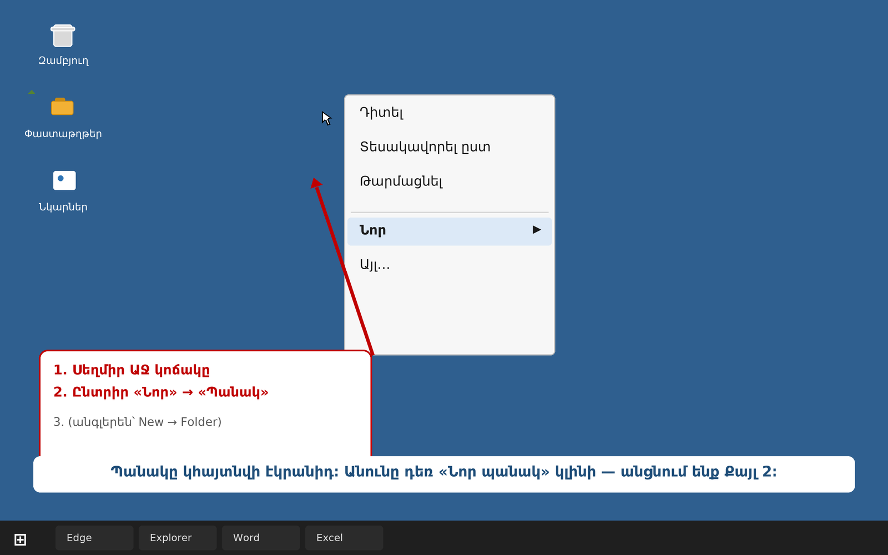

1. Փակիր բոլոր բացված պատուհանները, որ տեսնես **աշխատանքային սեղանը** (կապույտ ֆոնը)։
2. Սեղմիր **աջ** մկնիկի կոճակով աշխատանքային սեղանի **դատարկ տեղում**։
3. Բացված ցանկից ընտրիր **«Նոր»** → ապա **«Պանակ»**։
   *(եթե Windows-ը անգլերեն է՝ New → Folder)*

Սեղմված վիճակում պանակի անունը դառնում է կապույտ։ Անցնում ենք Քայլ 2-ին։

---

## Քայլ 2. Անվանիր պանակը՝ **ՏԵՆԴԵՐ**

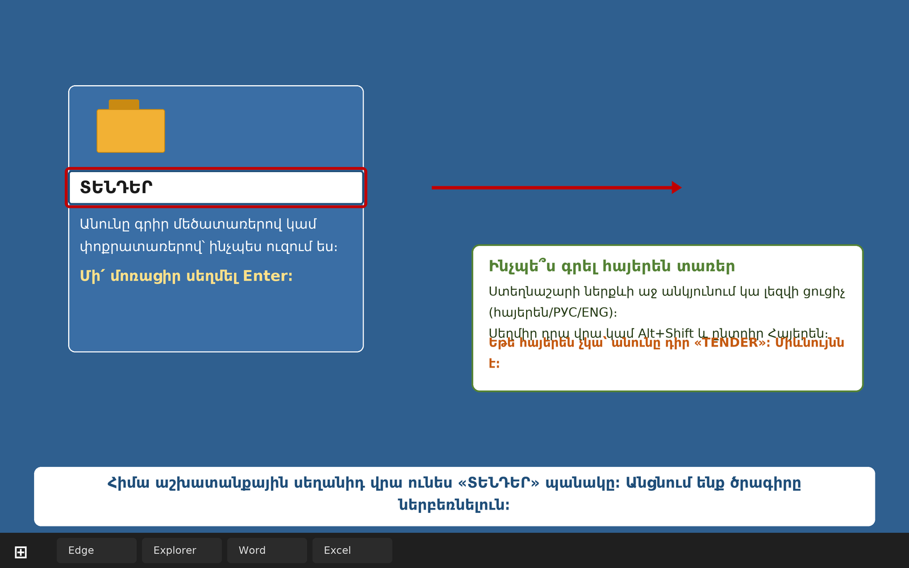

1. Ստեղնաշարից գրիր **ՏԵՆԴԵՐ** բառը։
2. Սեղմիր **Enter**։

💡 Հայերեն տառեր գրելու համար. ստեղնաշարի **ներքևի աջ անկյունում** կա լեզվի փոքրիկ ցուցիչ (հայերեն / РУС / ENG)։
Սեղմիր դրա վրա կամ `Alt+Shift` և ընտրիր Հայերեն։ **Եթե հայերեն չգտար՝ անունը դիր `TENDER`**, միևնույն է։

Աշխատանքային սեղանիդ վրա հիմա դրված է **«ՏԵՆԴԵՐ»** պանակը։ Սա մեր ծրագրի «տունն» է։

---

## Քայլ 3. Ներբեռնիր ծրագիրը

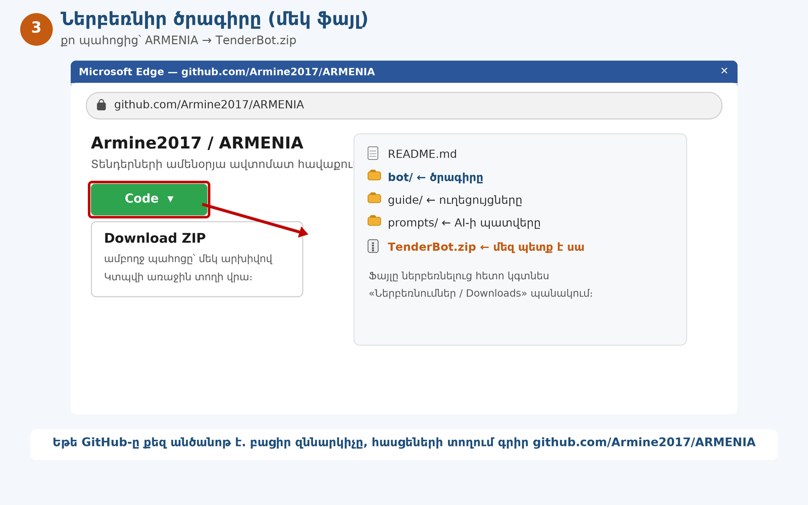

1. Բացիր զննարկիչը (`Microsoft Edge` կամ `Google Chrome`)։
2. Հասցեի տողում գրիր ու Enter սեղմիր. **`github.com/Armine2017/ARMENIA`**
3. Կանաչ **Code** կոճակի վրա սեղմիր → բացվող ցանկից ընտրիր **Download ZIP**։
4. Ֆայլը կներբեռնվի **«Ներբեռնումներ / Downloads»** պանակը (կարող ես հասնել՝ զննարկիչում `Ctrl+J` սեղմելով)։

---

## Քայլ 4. Բացիր ներբեռնված ZIP-ը (արխիվը)

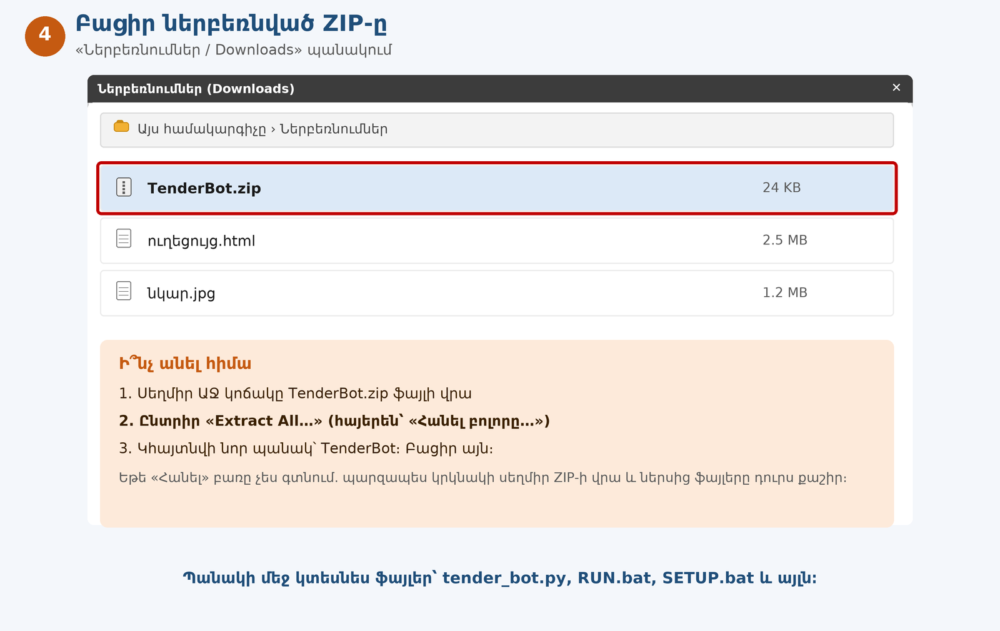

1. Բացիր **«Ներբեռնումներ / Downloads»** պանակը։
2. Սեղմիր **աջ** կոճակով **`TenderBot.zip`** ֆայլի վրա։
3. Ընտրիր **«Extract All…»** (հայերեն՝ «Հանել բոլորը…») → հետո **Extract / Հանել**։
4. Կհայտնվի նոր պանակ՝ **`TenderBot`**։ Բացիր այն։

💡 Եթե այդ կետը չես գտնում կամ շփոթվում ես. սեղմիր ZIP-ի վրա **երկու անգամ**, և ներսից ֆայլերը **մկնիկով քաշիր** աշխատանքային սեղան։ Միևնույնն է։

---

## Քայլ 5. Ֆայլերը տեղափոխիր **ՏԵՆԴԵՐ** պանակը

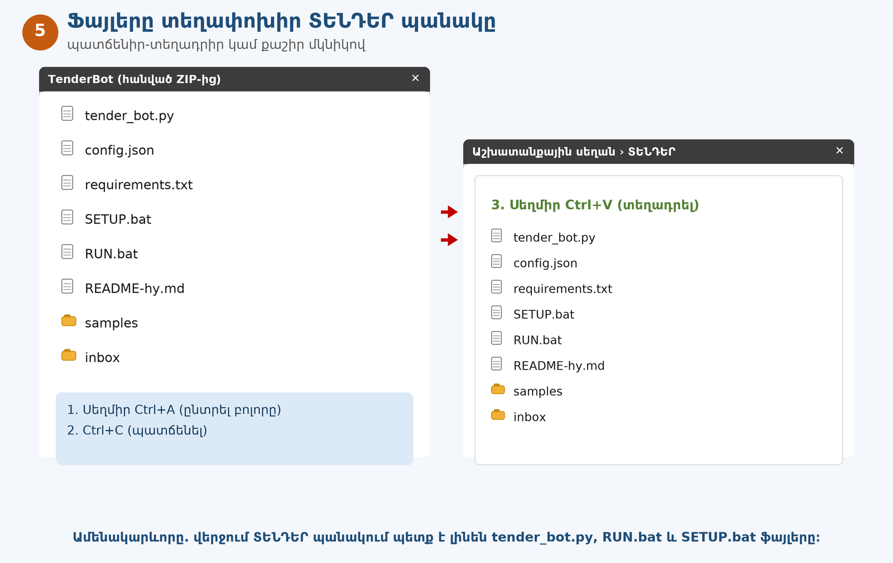

1. Բացիր **`TenderBot`** պանակը։
2. Սեղմիր **`Ctrl+A`** (ընտրվում են բոլոր ֆայլերը)։
3. Սեղմիր **`Ctrl+C`** (պատճենել)։
4. Գնա աշխատանքային սեղան → բացիր **`ՏԵՆԴԵՐ`** պանակը։
5. Սեղմիր **`Ctrl+V`** (տեղադրել)։

✅ Ստուգիր. **`ՏԵՆԴԵՐ`** պանակի մեջ պետք է լինեն առնվազն այս երեք ֆայլերը.
**`tender_bot.py`**, **`RUN.bat`**, **`SETUP.bat`**։

⚠️ **Եթե ֆայլերի անունները տեսնում ես առանց վերջավորության** (`tender_bot`՝ առանց `.py`), դա նորմալ է։
Windows-ը թաքցնում է վերջավորությունները։ Ոչինչ փոխել պետք չէ։

---

## Քայլ 6. Տեղադրիր Python-ը (միայն 1 անգամ)

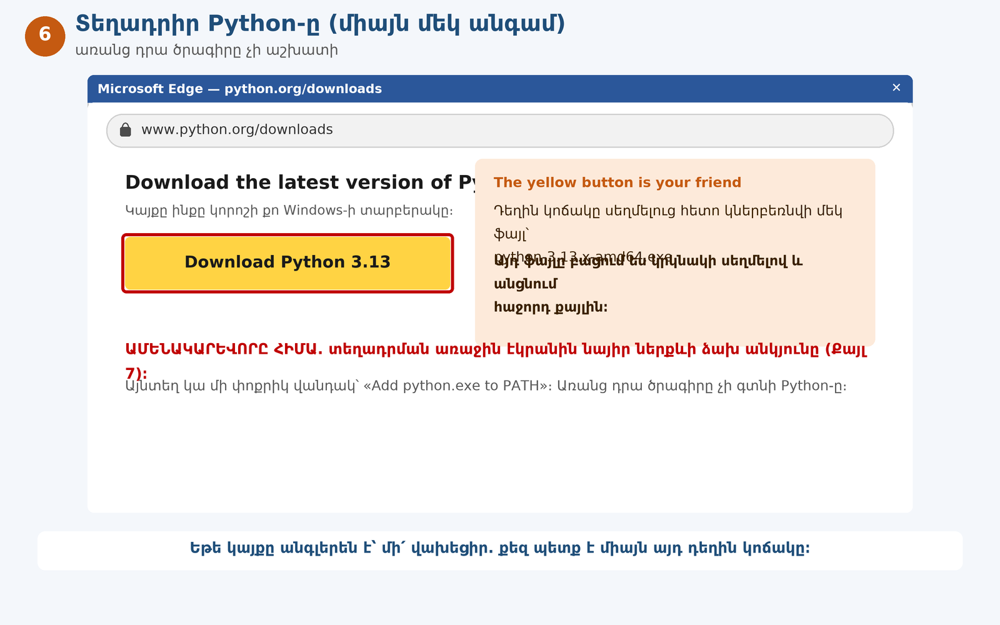

**Python**-ը այն «շարժիչն» է, որ աշխատեցնում է մեր ծրագիրը։ Առանց դրա ոչինչ չի աշխատի։

1. Զննարկիչի հասցեի տողում գրիր. **`python.org/downloads`**
2. Սեղմիր **դեղին «Download Python 3.x»** կոճակը։
3. Կներբեռնվի մի ֆայլ, օրինակ՝ `python-3.13.x-amd64.exe`։ **Բացիր այն կրկնակի սեղմելով**։

---

## Քայլ 7. ❗ ԱՄԵՆԱԿԱՐԵՎՈՐԸ. նշիր «Add python.exe to PATH» վանդակը

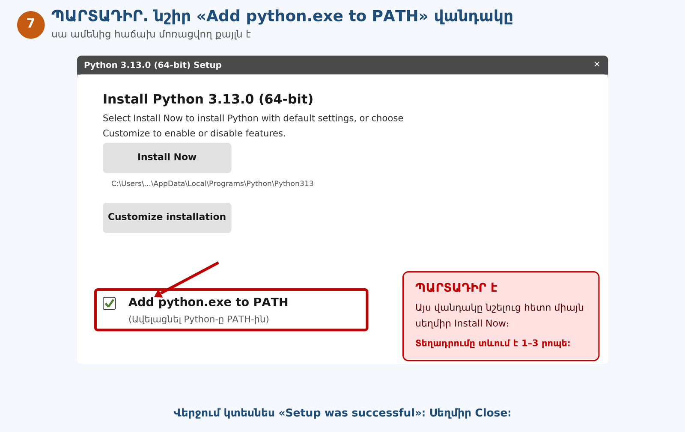

Բացված տեղադրման պատուհանի **ներքևի ձախ անկյունում** կա մի փոքրիկ վանդակ՝
**«Add python.exe to PATH»**։

1. **Նշիր** այդ վանդակը (մկնիկով սեղմիր, որ գա ✅)։
2. Հետո նոր միայն սեղմիր վերևի **«Install Now»** կոճակը։
3. Սպասիր 1–3 րոպե, մինչև գրվի **«Setup was successful»**։
4. Սեղմիր **Close**։

⛔ **Առանց այդ վանդակի ծրագիրը չի աշխատի։** Եթե մոռացար՝ նորից բացիր տեղադրող ֆայլը, ընտրիր `Modify`/`Uninstall` → նորից տեղադրիր վանդակով։

---

## Քայլ 8. Կրկնակի սեղմիր **SETUP.bat**-ը

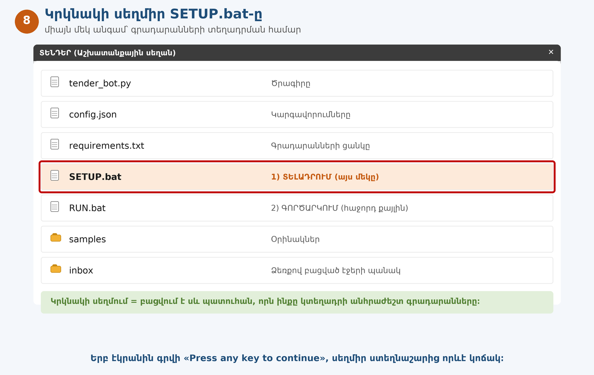

1. Բացիր **`ՏԵՆԴԵՐ`** պանակը (աշխատանքային սեղանին է)։
2. Կրկնակի սեղմիր **`SETUP.bat`** ֆայլի վրա։
3. Կբացվի **մեծ սև պատուհան**։ Սա բնական է. սա հրահանգների պատուհանն է։
4. Սպասիր մոտ մեկ րոպե, մինչև տողերի ցուցակը դադարի։
5. Երբ ներքևում գրվի **«Press any key to continue»**, սեղմիր ստեղնաշարից **որևէ** կոճակ (օր.՝ Space)։

💡 Սև պատուհանից չպետք է վախենալ. դա պարզապես ծրագրի «մտքերն է բարձրաձայն»։

---

## Քայլ 9. Ամեն օր՝ կրկնակի սեղմիր **RUN.bat**-ը

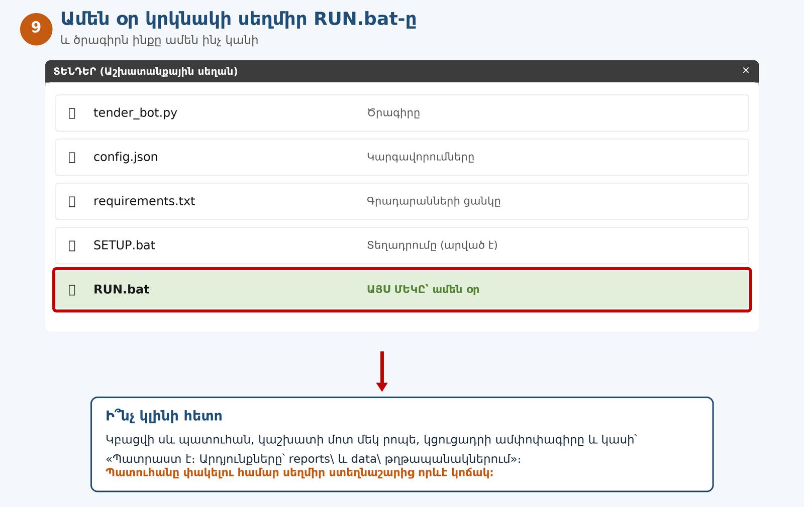

1. Նույն **`ՏԵՆԴԵՐ`** պանակում կրկնակի սեղմիր **`RUN.bat`** ֆայլի վրա։
2. Կրկին սև պատուհան կբացվի, այս անգամ կաշխատի **մոտ մեկ րոպե**։

**Ամեն օր անելիքդ հենց այսքան է.** 👉 Քայլ 9։
(Իսկ Քայլ 12-ում կասեմ, թե ինչպես ընդհանրապես մոռանաս այս մասին էլ։)

---

## Քայլ 10. Ահա թե ինչ պիտի տեսնես պատուհանում

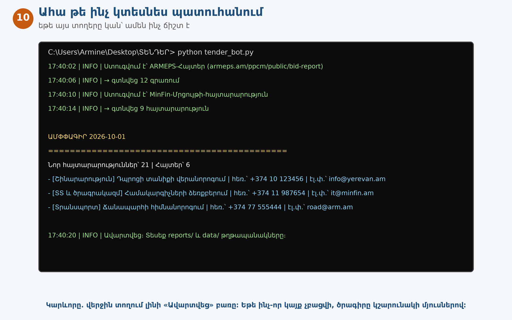

Եթե տեսնում ես նման տողեր (կարելի է՝ ուրիշ թվեր ու անուններ). **ամեն ինչ ճիշտ է աշխատում**։

Կարևոր երկու բառ.
- **«Ստուգվում է՝ …»** — ծրագիրը կայքն է կարդում։
- **«Ավարտվեց»** — վերջացավ, արդյունքը պատրաստ է։

⚠️ Եթե մի կայք չի բացվել, պատուհանում կգրվի «Չհաջողվեց…» — **խնդիր չկա**, ծրագիրը կշարունակի մյուս կայքերով, իսկ մանրամասնությունը կգրի `reports\logs` պանակում։

Պատուհանը փակելու համար սեղմիր ստեղնաշարից որևէ կոճակ։ Կամ ուղղակի փակիր պատուհանը (✕)։

---

## Քայլ 11. Բացիր արդյունքը՝ **reports** պանակը

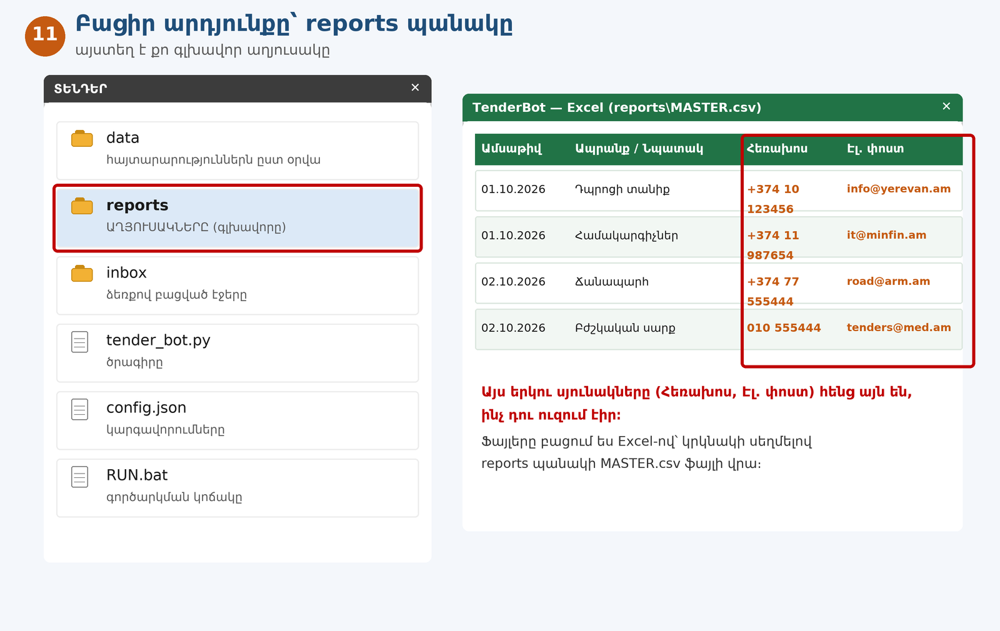

Վերադարձիր **`ՏԵՆԴԵՐ`** պանակ ու բացիր նոր ստեղծված **`reports`** պանակը։

Ներսում կտեսնես.
- **`MASTER.csv`** — 👑 գլխավոր աղյուսակը՝ **բոլոր օրերի** բոլոր հայտարարությունները։
- **`Հաշվետվություն-2026-10-01.csv`** — միայն այս օրվա նորերը։
- **`MASTER-Հայտեր.csv`** — «Հայտեր»-ի աղյուսակը (մասնակից, ՀՎՌՀ, հայտի գումարը)։
- **`Ամփոփագիր-2026-10-01.txt`** — կարճ ամփոփագիր բառերով։

**Ինչպես բացել աղյուսակը.** կրկնակի սեղմիր `MASTER.csv`-ի վրա, կբացվի **Excel**-ով։
Եթե հարցնի, թե ինչով բացել՝ ընտրիր Excel։ Եթե հայերեն տառերը տարօրինակ են, բացիր այսպես.
**Excel → File → Open → ընտրիր ֆայլը**։

**Աղյուսակի սյունակները.** Ամսաթիվ • Աղբյուր • Կատեգորիա • **Ապրանք / Առարկա (նպատակը)** • Կազմակերպություն • Ծածկագիր • Վերջնաժամկետ • Կարգավիճակ • **Հեռախոս** • **Էլ. փոստ** • Հղում • Պահպանված ֆայլ

---

## Քայլ 12. Թող ամեն օր ինքը աշխատի (քո կյանքի ամենահեշտ քայլը)

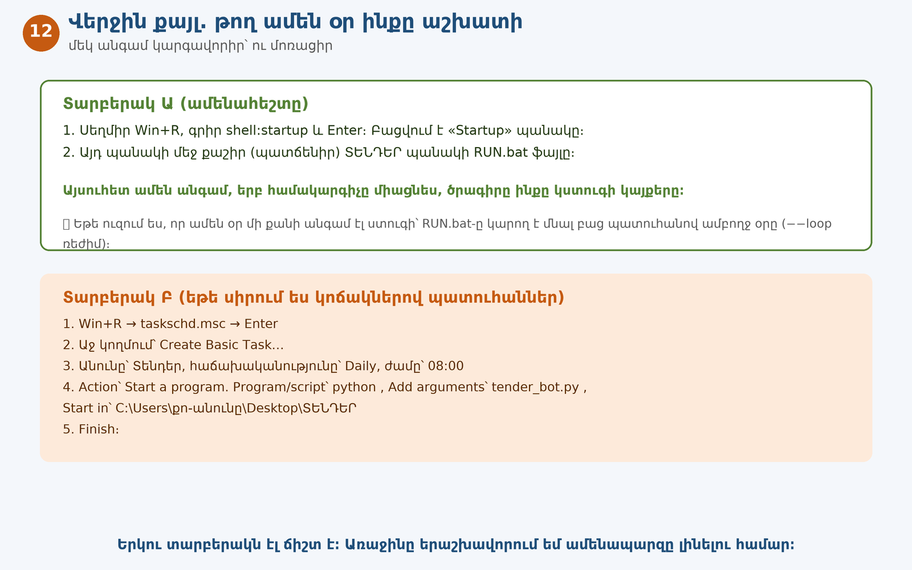

**Երկու տարբերակ կա, ընտրիր մեկին.**

### 🅰️ Տարբերակ Ա (ամենահեշտը — խորհուրդ եմ տալիս)
1. Ստեղնաշարից սեղմիր **`Win+R`**։
2. Գրիր **`shell:startup`** և սեղմիր Enter։ Բացվում է «Startup» (ինքնագործարկում) պանակը։
3. **`ՏԵՆԴԵՐ`** պանակից **`RUN.bat`** ֆայլը **քաշիր** այդ պատուհանի մեջ։

Դա՛ է։ Այսուհետ ամեն անգամ, երբ համակարգիչը միացնես, ծրագիրն ինքը կստուգի կայքերը։

### 🅱️ Տարբերակ Բ (եթե սիրում ես ստուգել ժամով)
1. `Win+R` → գրիր **`taskschd.msc`** → Enter։
2. Աջ կողմում՝ **Create Basic Task…** / «Ստեղծել պարզ առաջադրանք»։
3. Անունը՝ `Տենդեր`, հաճախականությունը՝ **Daily** / օրական, ժամը՝ `08:00`։
4. **Start a program** → 
   Program/script՝ `python`
   Add arguments՝ `tender_bot.py`
   Start in՝ `C:\Users\քո-անունը\Desktop\ՏԵՆԴԵՐ`
5. **Finish**։

⚠️ Երկու տարբերակում էլ. այն պահին **համակարգիչը պետք է միացած և ինտերնետին միացած լինի**։

---

# 🎉 Վերջ

Այսքանը։ Դու արեցիր այն, ինչ սովորաբար անում են ծրագրավորողները։

**Հիշելու 3 բան.**
1. **Նոր կայք ավելացնելու համար** բացիր `config.json`-ը Notepad-ով և ավելացրու հասցեների ցուցակում։
2. **Ամեն ինչ նորից հավաքելու համար** (հոկտեմբերից սկսած ամբողջ արխիվը)՝ բացիր հրամանի տողը այս պանակում և գրիր. `py tender_bot.py --archive`
3. **Երբ ինչ-որ բան չհասկանաս** — մի՛ կռահիր. պատճենիր սխալի տեքստը սև պատուհանից ու ուղարկիր ինձ կամ AI օգնականին և գրիր. «Ահա իմ սխալը, ուղղիր»։

---

📄 **Ավելի խորը տարբերակը** (բոլոր հնարավորություններով ու լրացուցիչ նկարներով)՝ `guide/step-by-step-hy.md`
📋 **AI-ին ուղղված պատվերը** (եթե ուզում ես քո սեփական ծրագիրը ստեղծել)՝ `prompts/PROMPT-hy.md`
